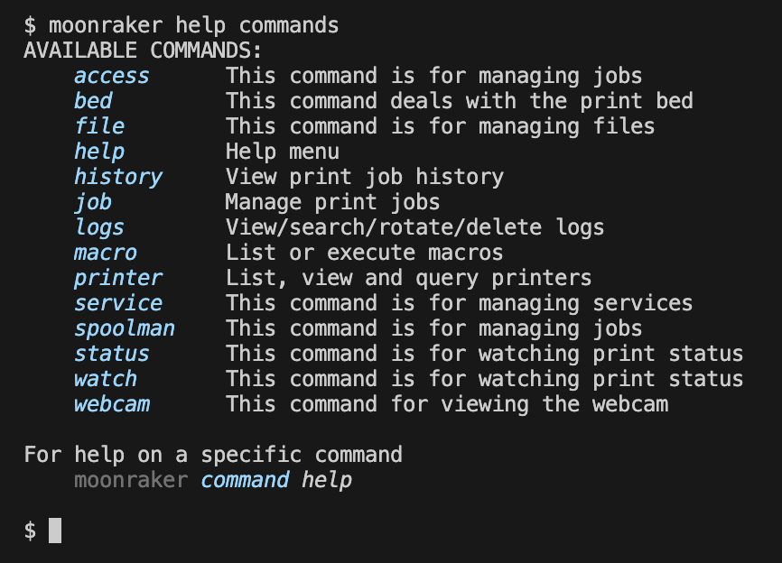
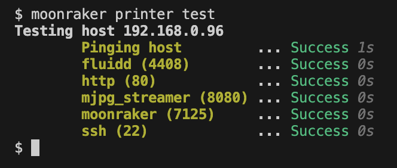
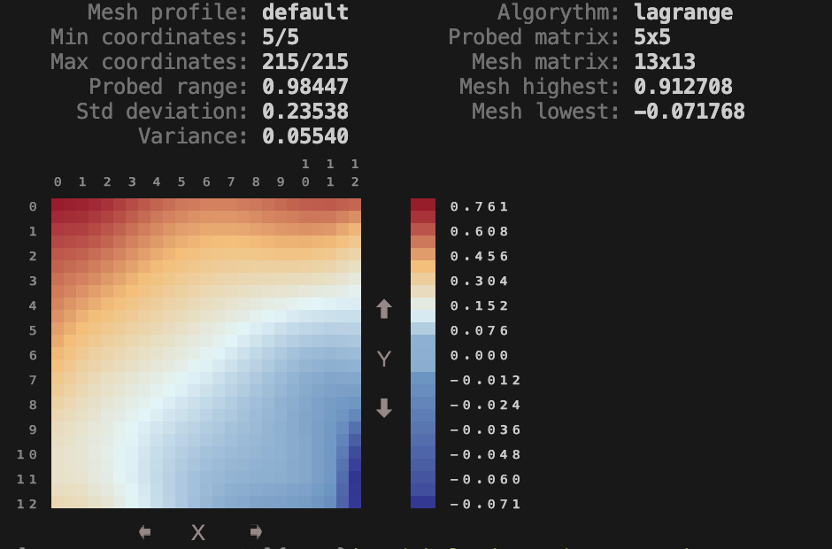
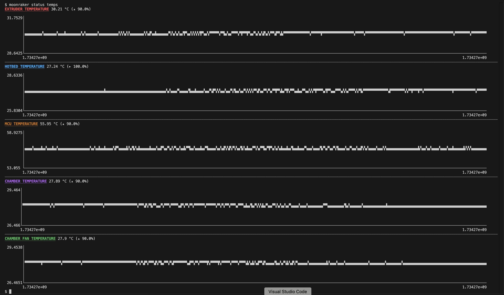

>  ⚠️ This isn't something that's actively maintained. There are some bugs that I have not fixed, or features I have not added. 
This was mostly only tested with my K1C printer, but should work for any printer running Klipper (with accessible Moonraker API).

----

# Install
```bash
$ git clone https://github.com/jhyland87/moonraker-cli.git
$ ./moonraker-cli/install
```

This should try to create a symlink to the `./moonraker-cli/moonraker` file at `/usr/local/bin/moonraker`. 

# Usage
`moonraker <subcommand> <arguments>`

# Project file structure
The main `moonraker` file is in the root. Each command is a .sh file inside the commands folder.

```
# Command file layout
moonraker-cli
├── moonraker
└── commands
  ├── bed.sh
  ├── example.sh
  ├── file.sh
  ├── help.sh
  ├── history.sh
  ├── job.sh
  ├── logs.sh
  ├── macro.sh
  ├── printer.sh
  ├── service.sh
  ├── status.sh
  ├── watch.sh
  └── webcam.sh
```

To execute a command: _moonraker_ __command__ _[args]_
Examples
```bash
# Show high level help
moonraker help 

# Show printer command help
moonraker printer help

# Show printer info
moonraker printer info

# Test printer service availability
moonraker printer test
```

----

## Screenshots

### Help


### Printer tests


### Bed Mesh Profile


### File list


### Printer temps


### Macros


## Todo
1. Implement authentication of moonraker is locked down.
2. Use config files for printer settings.
3. Ability to connect to multiple printers.
4. Unit tests?...
5. Tons of other things....